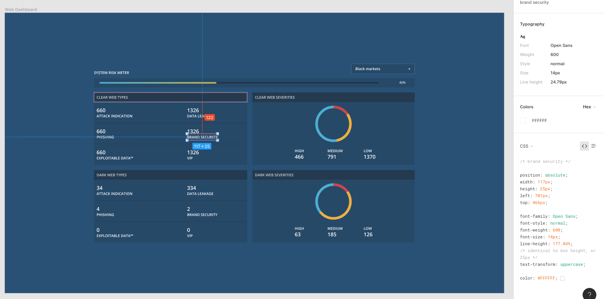

# IntSights challenge

## Main guidelines:
- Build a server side application based on NodeJS + ExpressJS, that will serve the data and static files to the client, and do data calculations if needed.
- Build a dashboard page according to the attached design, using Angular + HTML/CSS.
- The page should present calculated aggregation sums of 'severity' and 'type' split by 'networkType' for all the data provided in 'server/assets/data.json' .
- The dashboard should have a dropdown element that presents a list of all the unique values of 'sources' from the data file: 
  - Upon selecting a value from the dropdown the dashboard should update and show the data filtered by the selected source value (risk meter + aggregations)
- The dashboard page should present a risk meter which is calulated like so:
  - Use the top 300 results by the most recent date.
  - Each "severity" gets a strength as follows: High - 100, Medium - 70, Low - 40.
  - Each "type" gets a strength as follows: VIP - 100, AttackIndication - 80, ExploitableData - 60, BrandSecurity - 40, DataLeakage - 20, Phishing - 10.
  - Calculate the "severity" strength grade. For example, if we have 100 results from each severity, the strength grade will be: 
      ((100 * 100 + 100 * 70 + 100 * 40) / 300).
  - Calculate the "type" strength grade accordingly.
  - The risk meter result is the average between the "severity" and the "type" strength grades (should be between 0 - 100). 
  - The result should appear in the HTML as a progress bar in a color gradient from blue to red (like in the design).
- The UI components for the risk meter, card and doughnut chart is provided, you should use them in your solution and add code to them if necessary.
- When you're done send us a zip file containing the solution.
- The webpage should be pixel perfect like the design.

## The page design:
- Use the link to we've sent you in the mail.
- The design is provided in Figma, which is an interface design application that runs in the browser (similar to Zeplin, Avocode, InvVision etc..), you need to log-in or create a user in Figma in order to see all the details.
- The aggregated numbers in the design are just for example and do not reflect the final solution.
- You can use Figma in order to measure distance and extract, CSS properties like color, and font. (Don't use Figma's position properties and put all element in position absolute).

  

- The font used is "open sans" (https://fonts.google.com/specimen/Open+Sans?selection.family=Open+Sans)

## Code standards emphasis:
- Add another README.md with instructions that explain how to run your app.
- Write the Angular client side in reusable components, and add directives/services if needed.
- Write clean code:
  - Do not leave unused lines, files and folders.
  - Do not leave debugging code.
  - Use conventional guidelines (http://www.w3schools.com/js/js_conventions.asp).
  - You can use any external server/client side library that will help you build a better application.
  - Make sure your code works on a clean environment.
  - Make sure the webpage works on the latest versions of Chrome.
  - It is recommended to use a linting tool that will validate the code standards.

## Bonus points:
- Put the provided data in a Mongodb instance and pull/calculate from the DB.
- Use docker for running the Node/Mongo server.
- Make the dashboard page as responsive as possible.
- Add CSS animations.

## Installation server side:
    cd server 
    npm install

## Run server
    npm start

## Installation client side:
    npm install -g @angular/cli
    cd client
    npm install

## Run client dev server
    ng serve
